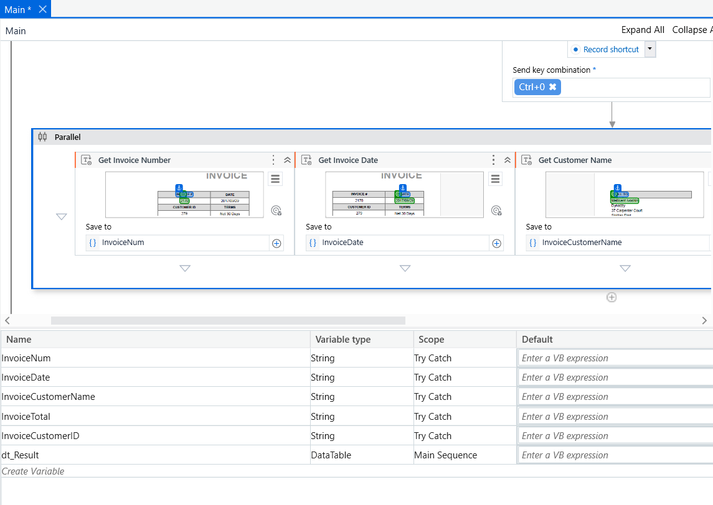
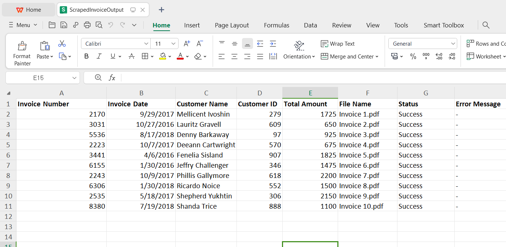

# PDF Scraper Bot — RPA Invoice Data Extraction

A Robotic Process Automation (RPA) bot built with UiPath that automatically extracts structured data from PDF invoice files and exports the results to Excel — eliminating manual data entry entirely.

Built as a course project at Universitas Airlangga — awarded **🏆 Best Campaign Contest** at the end-of-semester exhibition.


---

## Award


*Awarded Best Campaign Contest at the end-of-semester RPA exhibition, Universitas Airlangga.*

---

## Demo

### Workflow in UiPath Studio


*Parallel scraping activities extract Invoice Number, Invoice Date, and Customer Name simultaneously. Variables (InvoiceNum, InvoiceDate, InvoiceCustomerName, InvoiceTotal, InvoiceCustomerID) stored as String, results collected in a DataTable.*

### Excel Output


*10 invoices processed — all rows show Status: Success. Extracted fields: Invoice Number, Invoice Date, Customer Name, Customer ID, Total Amount, with File Name and Error Message logged per row.*

---

## Overview

Manual data entry from PDF invoices is slow and error-prone. This bot automates the full pipeline:

1. **Opens** each PDF file in Adobe Acrobat automatically
2. **Scrapes** five target fields in parallel using UiPath's scraping engine
3. **Writes** extracted data as a new row in a structured Excel spreadsheet
4. **Repeats** across all PDFs in the input folder sequentially
5. **Logs** file name, status (Success/Error), and error message per row

### Extracted Fields

| Field | Variable | Type |
|---|---|---|
| Invoice Number | `InvoiceNum` | String |
| Invoice Date | `InvoiceDate` | String |
| Customer Name | `InvoiceCustomerName` | String |
| Customer ID | `InvoiceCustomerID` | String |
| Total Amount | `InvoiceTotal` | String |

---

## Requirements

| Tool | Notes |
|---|---|
| UiPath Studio | Community Edition is free — [download here](https://www.uipath.com/start-trial) |
| Adobe Acrobat Reader | Any recent version |
| Microsoft Excel | 2016 or higher (or Office 365) |

---

## Project Structure

```
pdf-scraper-bot/
├── PDF-scraper-bot/
│   ├── Main.xaml                   # Main UiPath automation workflow
│   ├── project.json                # UiPath project config & dependencies
│   └── ScrapedInvoiceOutput.xlsx   # Sample output — 10 invoices extracted
├── 10_Invoice/                 # Sample PDF invoices (input files)
├── Images/
│   ├── workflow_overview.png   # UiPath Studio parallel scraping workflow
│   ├── excel.png               # Excel output with all 10 invoices
│   └── best_campaign_award.jpeg # Best Campaign Contest award
└── README.md
```

---

## Getting Started

### Step 1 — Clone the repo

```bash
git clone https://github.com/AlvinOctaH/pdf-scraper-bot.git
cd pdf-scraper-bot
```

### Step 2 — Open the project in UiPath Studio

1. Open UiPath Studio
2. Click **Open** → navigate to the `PDF-scraper-bot/` folder
3. Open `project.json` — UiPath will auto-resolve all dependencies
4. Open `Main.xaml` to inspect or modify the workflow

### Step 3 — Prepare input PDFs

Place your PDF invoice files inside the `10_Invoice/` folder. The bot processes all PDFs in that directory sequentially.

### Step 4 — Run the bot

Click **Run** in UiPath Studio. The bot will:
- Open each PDF via Adobe Acrobat
- Scrape all five fields in parallel
- Append each result as a new row in `ScrapedInvoiceOutput.xlsx`
- Log status (Success/Error) and any error messages per file

---

## How It Works

The bot uses UiPath's **UI Automation** and **Parallel** activities:

- **Open Application** — launches Adobe Acrobat and loads each PDF
- **Parallel** — runs Get Invoice Number, Get Invoice Date, Get Customer Name, Get Customer ID, and Get Total Amount simultaneously for faster extraction
- **Get Text / Screen Scraping** — locates each target field using UI element anchors on the PDF document
- **Add Data Row** — appends extracted variables into a DataTable (`dt_Result`)
- **Write Range** — writes the completed DataTable to `ScrapedInvoiceOutput.xlsx`
- **For Each File** — loops through all PDFs in `10_Invoice/` automatically

This approach reads text directly from selectable PDF elements — no OCR required — making extraction fast and accurate for standard invoice layouts.

---

## Limitations

- Designed for a specific invoice template. PDFs with different layouts require selector adjustments in UiPath Studio.
- Requires Adobe Acrobat — does not work with browser-based PDF viewers.
- Best suited for text-based PDFs; scanned/image PDFs require an additional OCR activity.

---

## Future Work

- Add OCR support for scanned PDFs using UiPath Document Understanding
- Generalize selectors to handle multiple invoice templates automatically
- Add email automation — send a summary report after each extraction batch

---

## Author

**Alvin Octa Hidayathullah**
B.Eng. Robotics & AI Engineering, Universitas Airlangga

[](https://github.com/AlvinOctaH)

---

## License

This project is licensed under the MIT License — see [LICENSE](LICENSE) for details.
